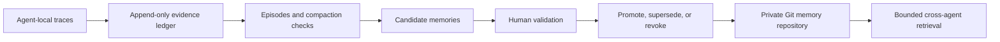

# Agent Memory System

[](https://github.com/rrrrrredy/agent-memory-system/actions/workflows/ci.yml)
[](LICENSE)

Local-first, evidence-backed memory for coding agents.

Agent Memory System preserves the task evidence a runtime exposes, rebuilds it
into episodes, turns supported observations into reviewable memory candidates,
and shares only human-approved, redacted memories through a separate private
Git repository.

It is built for a harder question than “what should the agent remember?”:

> What evidence supports this memory, is it still current, and can another
> machine use it without receiving the private transcript?

Status: **public beta**. Storage, derivation, review, memory lifecycle, private
Git synchronization, retrieval, encrypted recovery, and evaluation controls are
implemented. Runtime adapters remain version-sensitive. The system fails closed
when evidence is incomplete or a compatibility claim cannot be verified.

## Why this is different

Most memory tools summarize a conversation and place the summary in a retrieval
index. This project separates evidence, judgment, and distribution:



Raw transcripts, tool output, exposed reasoning, and local paths remain in the
local evidence store. Git receives only the portable projection of an approved
memory. A private repository is not treated as permission to upload raw task
history.

## Core guarantees

- Exact source bytes are content-addressed before normalization.
- Every evidence record participates in an append-only SHA-256 chain.
- A cross-process writer lock prevents compliant writers from forking a store.
- Missing, truncated, opaque, or unavailable data becomes an explicit gap.
- Candidates cannot become portable memory without a human validation and a
  separate human promotion.
- Conflicting candidates are quarantined; cross-device semantic conflicts are
  reported instead of resolved with last-write-wins.
- Active memories form immutable revision chains with explicit supersession and
  revocation.
- Retrieval verifies the complete portable repository, applies exact scope,
  result, token, and byte budgets, and records what was delivered.
- Raw evidence backup is optional, encrypted with age, and completely separate
  from the readable memory repository.
- `AGENTS.md`, Skills, and other rule surfaces are never changed without a
  distinct, target-bound approval.

These guarantees apply to locally available evidence. No client can recover
provider-hidden reasoning or bytes that the runtime never exposed.

## Five-minute Codex path

Prerequisites: Go 1.25 or newer and an existing Codex session history.

```text
git clone https://github.com/rrrrrredy/agent-memory-system.git
cd agent-memory-system
go build -o agentmem ./cmd/agentmem

agentmem compatibility --agent codex
agentmem init --root <local-evidence-directory>
agentmem import codex --root <local-evidence-directory> --path <codex-sessions-directory>
agentmem derive episodes --root <local-evidence-directory>
agentmem derive candidates --root <local-evidence-directory> --episodes <episode-generation-from-previous-command>
agentmem review list --root <local-evidence-directory> --candidates <candidate-generation-from-previous-command>
```

The last command returns verified review-ready candidates and a SHA-256 of the
exact text for the promotion confirmation gate. It does not approve anything.

The [quickstart](docs/quickstart.md) provides copyable PowerShell and POSIX
commands for review, promotion, private Git export, and retrieval.

## Compatibility and verification

| Surface | Current evidence |
| --- | --- |
| Codex rollout import | Real-rollout acceptance on Windows, loss/compaction fixtures, and cross-platform protocol tests |
| Claude Code import | Transcript, history, companion, thinking, and unknown-block fixtures on Windows, macOS, and Linux |
| OpenCode plugin | Pinned OpenCode runtime starts on a GitHub-hosted runner, loads the plugin, creates a native session event, imports it, and verifies the ledger; no provider model or secret is used |
| Review and memory lifecycle | Human-bound review, promotion, supersession, revocation, secret scanning, and conflict tests |
| Cross-device memory | Private Git history verification, offline use, divergence handling, recovery, and hosted Windows/macOS/Linux tests |
| Learning efficacy | Frozen-corpus metrics and replay are implemented; efficacy certification remains blocked unless task execution is independently verified |

Run a local, non-mutating runtime probe:

```text
agentmem compatibility
```

The probe checks executable availability and version output. It does not claim
that an account is authenticated, that a provider ran a model, or that a native
session was captured. See [compatibility and evidence levels](docs/compatibility.md).

## Memory lifecycle

A portable memory is not an editable note. It is an immutable revision chain:

```text
promote -> active revision
active revision -> supersede -> new active revision
active revision -> revoke -> tombstone
```

Only the current, non-revoked head can be retrieved. Two roots, two children of
one parent, an altered historical file, or opposing active memories make
verification fail. See [promotion](docs/promotion.md) and
[portable memory](docs/portable-memory.md).

## Retrieval

Retrieval is deterministic and offline. It combines exact identity lookup,
Unicode word and CJK-bigram matching, scope specificity, evidence strength, and
stable tie-breaking. There is no zero-match fallback.

Use the CLI directly or expose the same verified search through a local stdio
MCP server:

```text
agentmem recall search --root <evidence> --repo <private-memory> --agent codex --query "release checks"
agentmem serve mcp --root <evidence> --repo <private-memory> --agent codex
```

Codex, Claude Code, and OpenCode consume the same portable protocol. Their
native hooks or plugins are optional; CLI and MCP remain the stable boundary.

## Storage boundaries

| Zone | Contains | May enter Git? |
| --- | --- | --- |
| Local evidence | Exact transcripts, tool output, exposed reasoning, normalized events, gaps, receipts | No |
| Portable memory | Reviewed and redacted Markdown/YAML revisions | Separate private repository only |
| Encrypted backup | Complete local evidence snapshot | Optional backup backend, never the memory repository |

Do not copy `~/.codex`, Agent state databases, session directories, or the local
evidence root into the memory repository. SQLite may be used as a rebuildable
local index, never as Git-merged canonical data.

## What the project does not claim

- It does not capture private chain-of-thought hidden by a provider.
- It does not treat a summary as the missing original reasoning.
- It does not automatically promote model-written claims.
- It does not silently merge semantic conflicts.
- It does not prove that retrieval improves work merely because retrieval ran.
- It does not modify Agent rules or install hooks without explicit approval.

## Repository map

- `cmd/agentmem`: cross-platform CLI
- `adapters`: loss-aware Codex, Claude Code, and OpenCode importers
- `internal/ledger`: append-only evidence and content-addressed blobs
- `internal/episodes`, `internal/candidates`: reconstruction and extraction
- `internal/review`, `internal/promotion`: human decisions and memory lifecycle
- `internal/portable`, `internal/gitsync`: portable projection and private Git
- `internal/retrieval`, `internal/mcpserver`: bounded query and delivery
- `internal/evaluation`: frozen corpora, paired trials, metrics, and replay
- `internal/backup`, `internal/diagnostics`: encrypted recovery and integrity
- `schemas`: versioned public JSON contracts
- `docs/adr`: architectural decisions and threat boundaries

Detailed protocol documentation lives under [`docs`](docs). Start with the
[product contract](docs/product-contract.md), [threat model](docs/threat-model.md),
and [verification guide](docs/verification.md).

## Development

```text
go test ./...
go vet ./...
go build ./cmd/agentmem
```

The CI matrix runs on Ubuntu, Windows, and macOS. Stateful safety packages also
run with the Go race detector. The OpenCode runtime smoke test installs its
pinned runtime only inside the disposable hosted runner.

See [CONTRIBUTING.md](CONTRIBUTING.md) before changing an adapter, schema, or
evidence boundary. Never attach real transcripts or raw evidence to an issue.

## License

MIT. See [LICENSE](LICENSE).
