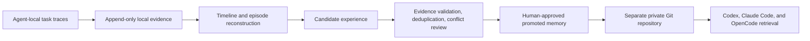

# Agent Memory System

Agent Memory System is a local-first, cross-agent, evidence-driven memory system
for Codex, Claude Code, and OpenCode.

It is designed around one non-negotiable rule: preserve every process record an
agent runtime makes locally available before deriving memories from it. Raw
evidence stays local by default. Only reviewed, redacted, promoted memories may
enter a separate private Git repository.

> Status: early foundation. The evidence protocol, local ledger, and safety
> boundaries are being implemented before any memory automation is enabled.

## Product boundary



The evidence layer records every locally obtainable user instruction, agent
message, tool call and result, approval, file change, sub-agent event,
compaction boundary, and reasoning artifact. It records unavailable material as
a gap instead of silently claiming completeness.

This distinction matters: a model may keep private reasoning that a client
never receives. The system can preserve exposed text, summaries, and encrypted
payloads exactly as obtained, but it cannot reconstruct content that the
provider never exposes.

## Storage zones

| Zone | Canonical data | Git policy |
| --- | --- | --- |
| Local evidence | Exact source bytes, normalized events, integrity chain | Never committed |
| Promoted memory | Reviewed, redacted Markdown/YAML and append-only revisions | Separate private repository |
| Evidence backup | Optional encrypted snapshots of local evidence | Separate backend, never the memory repository |

SQLite may be used as a rebuildable local index. It is never cross-device
canonical data and is never merged through Git.

## Repository layout

- `cmd/agentmem`: cross-platform CLI
- `internal/ledger`: append-only evidence storage and integrity verification
- `schemas`: versioned interchange contracts
- `docs/adr`: architecture decisions
- `docs/research`: adopt/modify/reject reviews of related projects
- `adapters`: Codex, Claude Code, and OpenCode adapters (planned)
- `evals`: continuous-learning and sync reliability evaluations (planned)

## Development

Go 1.24 or newer is required.

```text
go test ./...
go run ./cmd/agentmem init --root <local-data-directory>
go run ./cmd/agentmem doctor --root <local-data-directory>
```

On this Windows workstation, project code lives in
`D:\Codex\agent-memory-system`; a runtime evidence directory should be
outside the Git worktree.

## Safety

- Never paste or attach raw evidence to GitHub issues or pull requests.
- Never point Git synchronization at a Codex, Claude Code, or OpenCode internal
  state directory.
- No candidate experience is automatically injected into future tasks.
- A memory must carry provenance, scope, status, and evidence before promotion.
- Changes to `AGENTS.md`, Skills, hooks, or global agent configuration require
  explicit user approval.

See [the product contract](docs/product-contract.md) for normative requirements.
