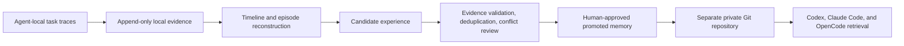

# Agent Memory System

Agent Memory System is a local-first, cross-agent, evidence-driven memory system
for Codex, Claude Code, and OpenCode.

It is designed around one non-negotiable rule: preserve every process record an
agent runtime makes locally available before deriving memories from it. Raw
evidence stays local by default. Only reviewed, redacted, promoted memories may
enter a separate private Git repository.

> Status: early foundation. The evidence protocol, local ledger, and safety
> boundaries are being implemented before any memory automation is enabled.

## Product boundary



The evidence layer records every locally obtainable user instruction, agent
message, tool call and result, approval, file change, sub-agent event,
compaction boundary, and reasoning artifact. It records unavailable material as
a gap instead of silently claiming completeness.

This distinction matters: a model may keep private reasoning that a client
never receives. The system can preserve exposed text, summaries, and encrypted
payloads exactly as obtained, but it cannot reconstruct content that the
provider never exposes.

## Storage zones

| Zone | Canonical data | Git policy |
| --- | --- | --- |
| Local evidence | Exact source bytes, normalized events, integrity chain | Never committed |
| Promoted memory | Reviewed, redacted Markdown/YAML and append-only revisions | Separate private repository |
| Evidence backup | Optional encrypted snapshots of local evidence | Separate backend, never the memory repository |

SQLite may be used as a rebuildable local index. It is never cross-device
canonical data and is never merged through Git.

## Repository layout

- `cmd/agentmem`: cross-platform CLI
- `internal/ledger`: append-only evidence storage and integrity verification
- `internal/review`: append-only candidate review and optimistic state checks
- `schemas`: versioned interchange contracts
- `docs/adr`: architecture decisions
- `docs/research`: adopt/modify/reject reviews of related projects
- `adapters`: Codex, Claude Code, and OpenCode evidence adapters
- `evals`: continuous-learning and sync reliability evaluations (planned)

## Development

Go 1.24 or newer is required.

```text
go test ./...
go run ./cmd/agentmem init --root <local-data-directory>
go run ./cmd/agentmem import codex --root <local-data-directory> --path <rollout-file-or-directory>
go run ./cmd/agentmem import claude --root <local-data-directory> --path <transcript-file-or-directory>
go run ./cmd/agentmem import claude-home --root <local-data-directory> --path <claude-home-directory>
go run ./cmd/agentmem import opencode-export --root <local-data-directory> --path <export-file-or-directory>
go run ./cmd/agentmem import opencode-events --root <local-data-directory> --path <event-spool-file-or-directory>
go run ./cmd/agentmem capture opencode --root <local-data-directory> --staging <non-Git-local-directory>
go run ./cmd/agentmem derive episodes --root <local-data-directory>
go run ./cmd/agentmem derive candidates --root <local-data-directory> --episodes <episode-generation>
go run ./cmd/agentmem review apply --root <local-data-directory> --candidates <candidate-generation> --file <review-request.json>
go run ./cmd/agentmem review status --root <local-data-directory> --candidates <candidate-generation> --candidate <candidate-id>
go run ./cmd/agentmem review verify --root <local-data-directory>
go run ./cmd/agentmem doctor --root <local-data-directory>
```

The JSONL importers store exact append segments as content-addressed local
blobs, then write normalized events that point back to byte ranges in those
segments. Re-running them is idempotent. Use `--full-reconcile` to deliberately
re-read an entire source and detect earlier in-place changes; the default mode
starts at the last committed byte. See each adapter's `CAPABILITIES.md` before
relying on it for complete capture.

`claude-home` is the preferred Claude Code reconciliation command. In addition
to project and subagent transcripts, it captures prompt history and documented
session companion artifacts such as spilled tool results, file-history
snapshots, plans, tasks, debug logs, paste/image attachments, and session
metadata. It intentionally excludes settings, OAuth state, plugins, config
backups, and generic caches.

For OpenCode, historical reconciliation starts from native unsanitized session
exports. Optional live capture writes bus events to a local append-only spool;
the export remains necessary to recover pre-installation history and missed
events. The OpenCode SQLite database is never treated as cross-device data.
`capture opencode` enumerates every native session, writes immutable exports and
command diagnostics to staging, imports them, and returns a non-zero status if
any session is incomplete. It refuses staging inside a Git worktree.

Keep runtime evidence and raw staging directories outside every Git worktree.

`derive episodes` reconstructs a deterministic per-thread process timeline and
episode generation from the hash-chain-verified ledger prefix. Derived files
remain under the local evidence root. Compaction checks distinguish confirmed
repeated user correction evidence from lexical risk and unavailable
representations; none of these results is promoted memory. See
[episode derivation](docs/episodes.md).

`derive candidates` converts evidence-linked episode statements into local
review material. Ordinary task goals are excluded, opposing instructions are
quarantined, and every result remains ineligible for automatic promotion. See
[candidate derivation](docs/candidates.md).

`review apply` records a human-attested, content-hash-bound transition in a
local append-only review ledger. It verifies referenced evidence, rejects stale
expected states, and requires atomic resolution of derived conflict groups.
`validated` is still not promoted or retrievable. See
[candidate review](docs/review.md).

## Safety

- Never paste or attach raw evidence to GitHub issues or pull requests.
- Never point Git synchronization at a Codex, Claude Code, or OpenCode internal
  state directory.
- No candidate experience is automatically injected into future tasks.
- A memory must carry provenance, scope, status, and evidence before promotion.
- Changes to `AGENTS.md`, Skills, hooks, or global agent configuration require
  explicit user approval.

See [the product contract](docs/product-contract.md) for normative requirements.
