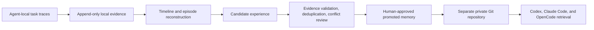

# Agent Memory System

Agent Memory System is a local-first, cross-agent, evidence-driven memory system
for Codex, Claude Code, and OpenCode.

It is designed around one non-negotiable rule: preserve every process record an
agent runtime makes locally available before deriving memories from it. Raw
evidence stays local by default. Only reviewed, redacted, promoted memories may
enter a separate private Git repository.

> Status: v1alpha1 foundation. Evidence capture, review and promotion, portable
> memory, verified Git synchronization, bounded cross-Agent retrieval,
> evidence-bound evaluation, and authenticated encrypted backup and recovery
> are implemented.

## Product boundary



The evidence layer records every locally obtainable user instruction, agent
message, tool call and result, approval, file change, sub-agent event,
compaction boundary, and reasoning artifact. It records unavailable material as
a gap instead of silently claiming completeness.

This distinction matters: a model may keep private reasoning that a client
never receives. The system can preserve exposed text, summaries, and encrypted
payloads exactly as obtained, but it cannot reconstruct content that the
provider never exposes.

## Storage zones

| Zone | Canonical data | Git policy |
| --- | --- | --- |
| Local evidence | Exact source bytes, normalized events, integrity chain | Never committed |
| Promoted memory | Reviewed, redacted Markdown/YAML and append-only revisions | Separate private repository |
| Evidence backup | Optional encrypted snapshots of local evidence | Separate backend, never the memory repository |

SQLite may be used as a rebuildable local index. It is never cross-device
canonical data and is never merged through Git.

## Repository layout

- `cmd/agentmem`: cross-platform CLI
- `internal/ledger`: append-only evidence storage and integrity verification
- `internal/review`: append-only candidate review and optimistic state checks
- `internal/promotion`: redacted promoted revisions, supersession, and revocation
- `internal/portable`: private-Git-safe projection and semantic conflict checks
- `internal/gitsync`: append-only Git history validation and explicit synchronization
- `internal/retrieval`: verified ranking, bounded context, and local use receipts
- `internal/evaluation`: frozen corpora, attestations, metrics, gates, and run verification
- `internal/backup`: age-encrypted evidence snapshots, streaming verification, and no-overwrite restore
- `internal/diagnostics`: full local and private-repository recovery checks
- `internal/mcpserver`: shared Codex, Claude Code, and OpenCode query surface
- `internal/secretscan`: deterministic, non-echoing sensitive-content detection
- `internal/ruleapproval`: separate revision-, surface-, and target-bound rule authorization
- `schemas`: versioned interchange contracts
- `docs/adr`: architecture decisions
- `docs/research`: adopt/modify/reject reviews of related projects
- `adapters`: Codex, Claude Code, and OpenCode evidence adapters
- `integrations`: optional Agent-native live capture and injection bridges
- `evals`: synthetic continuous-learning and sync reliability fixtures

## Development

Go 1.25 or newer is required.

```text
go run ./cmd/agentmem version
go test ./...
go run ./cmd/agentmem init --root <local-data-directory>
go run ./cmd/agentmem import codex --root <local-data-directory> --path <rollout-file-or-directory>
go run ./cmd/agentmem import claude --root <local-data-directory> --path <transcript-file-or-directory>
go run ./cmd/agentmem import claude-home --root <local-data-directory> --path <claude-home-directory>
go run ./cmd/agentmem import opencode-export --root <local-data-directory> --path <export-file-or-directory>
go run ./cmd/agentmem import opencode-events --root <local-data-directory> --path <event-spool-file-or-directory>
go run ./cmd/agentmem capture hook codex --root <local-data-directory>
go run ./cmd/agentmem capture hook claude-code --root <local-data-directory>
go run ./cmd/agentmem capture reconcile codex --root <local-data-directory> --path <codex-rollout-file-or-sessions-directory>
go run ./cmd/agentmem capture reconcile claude-code --root <local-data-directory> --path <claude-home-directory>
go run ./cmd/agentmem capture opencode --root <local-data-directory> --staging <non-Git-local-directory>
go run ./cmd/agentmem derive episodes --root <local-data-directory>
go run ./cmd/agentmem derive candidates --root <local-data-directory> --episodes <episode-generation>
go run ./cmd/agentmem review apply --root <local-data-directory> --candidates <candidate-generation> --file <review-request.json>
go run ./cmd/agentmem review status --root <local-data-directory> --candidates <candidate-generation> --candidate <candidate-id>
go run ./cmd/agentmem review verify --root <local-data-directory>
go run ./cmd/agentmem promote scan --root <local-data-directory> --candidates <candidate-generation> --candidate <candidate-id>
go run ./cmd/agentmem promote apply --root <local-data-directory> --file <promotion-request.json>
go run ./cmd/agentmem promote status --root <local-data-directory> --memory <memory-id>
go run ./cmd/agentmem promote verify --root <local-data-directory>
go run ./cmd/agentmem rule-approval apply --root <local-data-directory> --file <rule-approval-request.json>
go run ./cmd/agentmem rule-approval status --root <local-data-directory> --memory <memory-id> --revision <revision-id> --surface <surface> --target <target>
go run ./cmd/agentmem rule-approval verify --root <local-data-directory>
go run ./cmd/agentmem portable init --repo <private-memory-directory>
go run ./cmd/agentmem portable export --root <local-data-directory> --repo <private-memory-directory>
go run ./cmd/agentmem portable verify --repo <private-memory-directory>
go run ./cmd/agentmem sync bootstrap --repo <private-memory-directory> --remote-url <private-git-url>
go run ./cmd/agentmem sync run --repo <private-memory-directory>
go run ./cmd/agentmem sync verify --repo <private-memory-directory>
go run ./cmd/agentmem recall search --root <local-data-directory> --repo <private-memory-directory> --agent codex --query <terms>
go run ./cmd/agentmem recall context --root <local-data-directory> --repo <private-memory-directory> --agent codex --query <terms> --output text
go run ./cmd/agentmem recall verify --root <local-data-directory>
go run ./cmd/agentmem serve mcp --root <local-data-directory> --repo <private-memory-directory> --agent codex
go run ./cmd/agentmem eval corpus freeze --root <local-data-directory> --legacy-root <legacy-context-journal-directory> --allow-incomplete
go run ./cmd/agentmem eval corpus verify --root <local-data-directory> --corpus <corpus-id>
go run ./cmd/agentmem eval corpus baseline --root <local-data-directory> --corpus <corpus-id> --run <run-id> --system-version <version>
go run ./cmd/agentmem eval attest --root <local-data-directory> --file <evaluation-attestation.json>
go run ./cmd/agentmem eval run --root <local-data-directory> --file <evaluation-input.json> --repo <private-memory-directory> --enforce
go run ./cmd/agentmem eval verify --root <local-data-directory> --suite <suite-id> --run <run-id>
go run ./cmd/agentmem backup keygen --identity <separate-private-key-file>
go run ./cmd/agentmem backup create --root <local-data-directory> --output <encrypted-archive> --recipient <age-recipient>
go run ./cmd/agentmem backup verify --archive <encrypted-archive> --identity <separate-private-key-file>
go run ./cmd/agentmem backup restore --archive <encrypted-archive> --identity <separate-private-key-file> --target <new-local-data-directory>
go run ./cmd/agentmem doctor --root <local-data-directory> --repo <private-memory-directory> --require-repo
```

The JSONL importers store exact append segments as content-addressed local
blobs, then write normalized events that point back to byte ranges in those
segments. Re-running them is idempotent. Use `--full-reconcile` to deliberately
re-read an entire source and detect earlier in-place changes; the default mode
starts at the last committed byte. See each adapter's `CAPABILITIES.md` before
relying on it for complete capture.

Optional Codex and Claude Code lifecycle hooks stream their exact stdin into a
durable local spool without scanning the ledger, opening the transcript, or
applying a fixed input-size cutoff. `capture reconcile` later imports that
spool together with the configured historical source and records missing,
partial, unreadable, or out-of-root transcript hints as explicit gaps. No hook
configuration is installed automatically. See [continuous local capture](docs/capture.md).

`claude-home` is the preferred Claude Code reconciliation command. In addition
to project and subagent transcripts, it captures prompt history and documented
session companion artifacts such as spilled tool results, file-history
snapshots, plans, tasks, debug logs, paste/image attachments, and session
metadata. It intentionally excludes settings, OAuth state, plugins, config
backups, and generic caches.

For OpenCode, historical reconciliation starts from native unsanitized session
exports. Optional live capture writes bus events to a local append-only spool;
the export remains necessary to recover pre-installation history and missed
events. The OpenCode SQLite database is never treated as cross-device data.
`capture opencode` enumerates every native session, writes immutable exports and
command diagnostics to staging, imports them, and returns a non-zero status if
any session is incomplete. It refuses staging inside a Git worktree.

Keep runtime evidence and raw staging directories outside every Git worktree.

`derive episodes` reconstructs a deterministic per-thread process timeline and
episode generation from the hash-chain-verified ledger prefix. Derived files
remain under the local evidence root. Compaction checks distinguish confirmed
repeated user correction evidence from lexical risk and unavailable
representations; none of these results is promoted memory. See
[episode derivation](docs/episodes.md).

`derive candidates` converts evidence-linked episode statements into local
review material. Ordinary task goals are excluded, opposing instructions are
quarantined, and every result remains ineligible for automatic promotion. See
[candidate derivation](docs/candidates.md).

`review apply` records a human-attested, content-hash-bound transition in a
local append-only review ledger. It verifies referenced evidence, rejects stale
expected states, and requires atomic resolution of derived conflict groups.
`validated` is still not promoted or retrievable. See
[candidate review](docs/review.md).

`promote apply` creates an immutable, parent-linked revision only from the exact
currently validated candidate. Sensitive findings must be covered by
hash-bound redactions, and the reviewed final text hash must match. Supersession
and revocation use optimistic parent checks. These local revisions are not
written to Git until the separate memory-repository workflow is configured. See
[promoted memory revisions](docs/promotion.md).

Promotion never authorizes changes to `AGENTS.md`, Skills, hooks, plugins, or
global rules. `rule-approval apply` records that decision separately for one
exact memory revision, surface, and logical target, without editing the target
itself.

`portable export` builds a separate allowlisted Markdown projection. It keeps
local proof hashes, byte ranges, device and approver metadata, reasons, paths,
and raw evidence out of Git. Immutable parent-linked files expose forks and
semantic conflicts instead of resolving them with last-write-wins. See
[the portable memory repository](docs/portable-memory.md).

`sync run` is the default manual synchronization path. It validates every
reachable data commit, rejects deletions and non-allowlisted historical paths,
fetches into an isolated reference, and tests divergent merges in a temporary
worktree before advancing or pushing the local branch. Repository-local
pre-commit and pre-push guards use the same verifier. See
[private Git synchronization](docs/git-sync.md).

Optional `sync auto` commands install a per-device user schedule on Windows or
macOS. Scheduled attempts export only eligible promoted memory and call the
same non-interactive synchronization core. Bounded retries, suspension,
explicit recovery, and a local hash-chained audit make failures observable;
automation config remains ignored by Git.

`recall search`, `get`, and `context` verify the complete portable repository,
enforce exact configured scopes, and read only active promoted revisions. The
deterministic offline baseline has no unrelated fallback and enforces item,
estimated-token, and UTF-8 byte budgets. A shared local MCP server supports all
three Agents; optional Codex, Claude Code, and OpenCode injection bridges fail
open without returning stale or partially verified memory. Retrieval, actual
delivery, and downstream adoption are recorded separately. See
[cross-Agent retrieval](docs/retrieval.md).

`eval corpus freeze` turns legacy cards and referenced rollout snapshots into
a hash-bound local regression corpus without promoting them. Raw capture and
parser projection gaps are measured separately. Interpretive quality labels
must be recorded first as append-only case attestations, and a run cannot pass
on empty samples or unresolved evidence. See
[continuous-learning evaluation](docs/evaluation.md).

`backup create` produces one authenticated age archive outside every Git
worktree. It verifies the ledger before capture, rejects active writers and
links, hashes every included file while capturing, archiving, and rechecking,
and aborts if the source changes.
`backup verify` checks ciphertext, manifest, file hashes, ledger records, and
blob references without extracting plaintext. Restore targets must not exist;
successful recovery appends a local restore record before committing the new
store. See [encrypted evidence backup and recovery](docs/backup-recovery.md).

`doctor` verifies the complete local learning state. With `--repo` it also
checks the portable repository and reachable Git history; `--require-repo`
makes that repository mandatory for new-device acceptance.

Tagged releases publish checksum-listed Windows, macOS, and Linux binaries.
The installers under `scripts` replace only the Windows or macOS executable and
never edit evidence, Agent configuration, hooks, or synchronization schedules.

## Safety

- Never paste or attach raw evidence to GitHub issues or pull requests.
- The evidence ledger refuses roots inside Git worktrees.
- Never point Git synchronization at a Codex, Claude Code, or OpenCode internal
  state directory.
- Keep every backup identity separate from both its encrypted archive and the
  private promoted-memory Git repository.
- Never restore one logical evidence store onto two devices that will continue
  writing concurrently.
- No candidate experience is automatically injected into future tasks.
- Any portable-repository verification issue blocks the whole retrieval.
- A memory must carry provenance, scope, status, and evidence before promotion.
- Changes to `AGENTS.md`, Skills, hooks, or global agent configuration require
  explicit user approval.

See [the product contract](docs/product-contract.md) for normative requirements.
